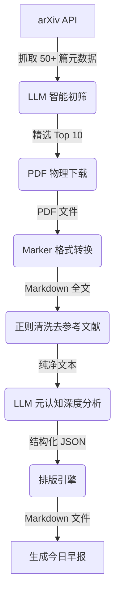

# 🗞️ AI 科研早报 (AI Research Daily)

> **“消除信息差，洞悉大模型演进的每一天。”**

这是一个高度自动化的 AI 科研情报流水线。它能够每日自动从 arXiv 抓取最新论文，利用大模型进行智能初筛，下载 PDF 全文并转换为 Markdown，最后使用**“元认知（Metacognition）”**框架对论文进行深度解码，生成一份极具阅读美感的 Markdown 报纸。

## ✨ 核心特性

*   **🧠 元认知深度解码**：超越传统的“摘要总结”，AI 将从**目的、本源、动力、边界、前沿**五个哲学维度为你剖析论文的底层逻辑。
*   **💰 极致的成本控制**：采用 `Map-Reduce` 策略。先用 LLM 阅读摘要进行 Top-N 初筛，再对精选论文进行全文分析，节省 80% 以上的 Token 消耗。
*   **📄 工业级 PDF 解析**：集成 `Marker-PDF`，精准还原学术论文中的数学公式、表格和排版，并自动切除冗余的参考文献。
*   **🛡️ 优雅的降级与容错**：内置强大的异常处理。如果 PDF 下载失败或 Marker 转换超时，流水线会自动降级为“仅使用摘要分析”，确保你每天早上都能准时收到早报。
*   **📰 报纸级排版引擎**：自动生成包含“头版社论”、“头版头条”、“深度解析”和“一句话快讯”的结构化 Markdown 文档。

## 🏗️ 系统架构



## 🚀 快速开始

### 1. 环境准备
*   Python 3.12+
*   建议使用虚拟环境 (Conda 或 venv)

### 2. 克隆与安装
```bash
git clone https://github.com/yourusername/arxiv-daily-news.git
cd arxiv-daily-news

# 安装核心依赖
pip install -r requirements.txt

# (强烈推荐) 安装 Marker-PDF 以启用全文解析
# 注意：需要系统支持 PyTorch，推荐配置 CUDA 环境
pip install marker-pdf
```

### 3. 配置环境变量
复制配置模板并填入你的大模型 API 密钥：
```bash
cp .env.example .env
```
编辑 `.env` 文件（推荐使用 DeepSeek 等长上下文且高性价比的模型）：
```env
LLM_API_KEY=sk-your-api-key
LLM_BASE_URL=https://api.deepseek.com
MODEL_NAME=deepseek-chat
```

### 4. 一键运行
```bash
python main.py
```
运行结束后，请前往 `data/reports/` 目录查看生成的《AI 科研早报》。

## 📂 目录结构说明

```text
arxiv-daily-news/
├── data/                   # 自动生成的数据目录 (PDF, MD, 最终报纸)
├── src/                    # 核心源代码
│   ├── analyzer/           # AI 分析模块 (初筛、元认知深度分析)
│   ├── converter/          # 格式转换模块 (Marker 封装、文本清洗)
│   ├── crawler/            # 爬虫模块 (arXiv API 交互、PDF 下载)
│   ├── generator/          # 排版生成模块 (Markdown 报纸渲染)
│   ├── config_manager.py   # 全局配置管理
│   └── models.py           # Pydantic 数据模型定义
├── .env.example            # 环境变量模板
├── main.py                 # 流水线总指挥 (入口文件)
└── requirements.txt        # 依赖清单
```

## 💡 进阶指南：元认知分析框架

本项目的核心亮点在于 `src/analyzer/summarizer.py` 中的 Prompt 设计。AI 将回答以下五个问题：
1.  **目的之问 (Purpose)**：解决什么核心痛点？
2.  **本源之问 (Origin)**：拆无可拆的底层实体或核心假设是什么？
3.  **动力之问 (Dynamics)**：这些底层基石是如何互动的？
4.  **边界之问 (Boundary)**：这个体系什么时候会失效或面临瓶颈？
5.  **前沿之问 (Frontier)**：为未来的 AI 发展指明了什么方向？

## 🛠️ 常见问题 (FAQ)

**Q: 运行到 Phase 4 时报错 `[WinError 2] 系统找不到指定的文件`？**
A: 这是因为你的系统中没有安装 `marker-pdf`，或者其命令 `marker_single` 不在环境变量中。程序会自动降级，仅使用论文摘要生成早报。如需全文分析，请执行 `pip install marker-pdf`。

**Q: 下载 PDF 时频繁报 404 错误？**
A: arXiv 的服务器有时会对爬虫进行拦截。本项目已内置 `export.arxiv.org` 备用节点和智能重试机制。如果依然失败，请检查你的网络环境是否能正常访问 arXiv。

## 📄 许可证
MIT License