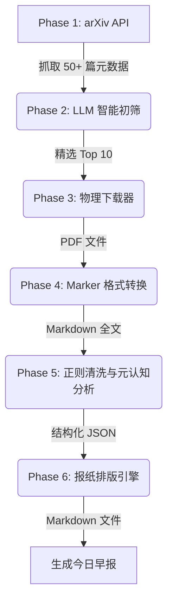

# 🌌 arXiv-Metacognition-Daily (多领域元认知科研早报系统)

> **“消除信息差，洞悉科学演进的每一天。”**

[](https://www.python.org/downloads/)
[](https://opensource.org/licenses/MIT)
[]()
[]()

## 📖 1. 项目背景与愿景 (Background & Vision)

在当今的学术界，无论是人工智能（AI）、材料科学（Materials Science）还是理论物理（Physics），每天都有数以百计的论文涌入 arXiv。面对这种**“信息爆炸”**，传统的 RSS 订阅或简单的“AI 摘要总结”已经无法满足顶尖研究人员的需求。简单的摘要往往流于表面，无法揭示论文背后的核心数学结构、物理假设或工程瓶颈。

为了解决这一痛点，**arXiv-Metacognition-Daily** 应运而生。

这不仅仅是一个爬虫脚本，而是一个**高度自动化、插件化、具备哲学思辨能力的 AI 科研情报流水线**。它摒弃了传统的“总结大意”，独创性地引入了**“元认知（Metacognition）”分析框架**。系统会自动下载 PDF 全文，利用大模型（LLM）从“目的、本源、动力、边界、前沿”五个维度对论文进行深度解构，最终生成一份极具阅读美感和深度洞察的 Markdown 报纸。

---

## ✨ 2. 核心特性 (Core Features)

### 🧩 2.1 极致的插件化架构 (Plugin-Driven Architecture)
系统采用“数据与逻辑分离”的设计哲学。内置了 **AI、材料科学、理论物理、现代数学** 四大领域画像（Profiles）。
你无需修改任何核心 Python 代码，只需在 YAML 配置文件中添加几行代码，即可在 1 分钟内让系统支持全新的学科（如生物医学、量化金融），实现真正的“热插拔”。

### 🧠 2.2 元认知深度解码 (Metacognitive Analysis)
系统拒绝生成“正确的废话”。在深度分析阶段，AI 会戴上“学术哲学家”的眼镜，强制回答五个直击灵魂的问题：
*   **目的之问**：解决什么核心痛点？
*   **本源之问**：拆无可拆的底层实体或核心假设是什么？
*   **动力之问**：这些底层基石是如何互动的？
*   **边界之问**：这个体系什么时候会失效或面临瓶颈？
*   **前沿之问**：为未来的科学发展指明了什么方向？

### 💰 2.3 Map-Reduce 成本控制策略 (Cost-Efficiency)
如果每天对 50 篇论文进行全文分析，API Token 成本将极其高昂。本项目采用智能两段式筛选：
1.  **Map (初筛)**：利用 LLM 快速阅读 50 篇论文的摘要，打分并挑选出 Top 10。
2.  **Reduce (深挖)**：仅对这 10 篇精选论文下载 PDF 全文并进行深度元认知分析。
此策略在保证情报质量的同时，**节省了 80% 以上的 API 费用**。

### 📄 2.4 工业级 PDF 解析与清洗 (Industrial PDF Parsing)
集成开源界最强的 PDF 解析工具 `Marker-PDF`。它基于深度学习（OCR + 布局分析），能够精准还原学术论文中的复杂数学公式、多栏排版和表格。同时，系统内置了正则清洗器（MarkdownCleaner），自动切除冗长且无用的“参考文献（References）”部分，进一步节约 Token 并提高 AI 的专注度。

### 🛡️ 2.5 优雅的降级与容错机制 (Graceful Degradation)
网络波动导致 PDF 下载失败？没有 GPU 导致 Marker 转换超时？
不用担心！系统内置了强大的容错机制。当全文提取失败时，程序**绝对不会崩溃**，而是会自动触发“降级模式”——让 AI 仅基于“标题 + 摘要”进行逻辑推演，确保你每天早上都能准时收到排版精美的早报。

---

## 🏗️ 3. 系统架构与流水线 (System Architecture)

本系统严格遵循六阶段流水线（Six-Phase Pipeline）设计，模块之间高度解耦：



1.  **Fetch Metadata**：根据当前激活的领域画像，向 arXiv 发起检索，获取最新论文元数据。
2.  **AI Ranking**：将摘要打包发送给 LLM，根据领域的特定标准（如 AI 领域的“算法创新”，材料领域的“合成工艺”）进行打分排序。
3.  **Download PDFs**：使用伪装 User-Agent 和 `export.arxiv.org` 备用节点，安全、稳定地将 PDF 下载到本地按日期分类的文件夹中。
4.  **Convert to Markdown**：调用本地 `marker_single` 进程，将二进制 PDF 转化为包含 LaTeX 公式的纯文本 Markdown。
5.  **Deep Analysis**：切除参考文献后，将数万字的全文喂给长上下文大模型，强制输出符合元认知框架的 JSON 数据。
6.  **Generate Report**：将结构化数据注入预设的报纸模板，自动生成社论、头版头条、二版专栏和快讯。

---

## 🚀 4. 安装与快速上手 (Quick Start)

### 4.1 环境准备
*   **操作系统**：Linux / macOS / Windows (WSL2 推荐)
*   **Python 版本**：>= 3.12.0
*   **硬件要求**：推荐配备 NVIDIA GPU（用于加速 Marker 的 PDF 解析），纯 CPU 环境亦可运行（速度较慢）。

### 4.2 克隆与基础安装
```bash
git clone https://github.com/yourusername/arxiv-metacognition-daily.git
cd arxiv-metacognition-daily

# 创建并激活虚拟环境 (推荐)
conda create -n arxiv_daily python=3.12
conda activate arxiv_daily

# 安装核心依赖
pip install -r requirements.txt
```

### 4.3 安装 Marker-PDF (强烈推荐)
为了让 AI 能够阅读论文全文，必须安装 Marker。
```bash
# 安装 Marker 及其深度学习依赖
pip install marker-pdf

# 验证安装是否成功
marker_single --help
```
*(注：Marker 依赖 PyTorch，首次运行会自动下载 OCR 模型权重，请保持网络畅通。)*

### 4.4 配置环境变量
复制配置模板并填入你的大模型 API 密钥：
```bash
cp .env.example .env
```
使用文本编辑器打开 `.env` 文件。由于本项目需要处理长达数万 Token 的全文，**强烈推荐使用长上下文且高性价比的模型（如 DeepSeek-V3 / Gemini-1.5-Flash / Qwen-Long）**：
```env
# 示例：使用 DeepSeek API
LLM_API_KEY=sk-your-api-key-here
LLM_BASE_URL=https://api.deepseek.com
MODEL_NAME=deepseek-chat
DEBUG=False
```

### 4.5 一键启动
在终端运行主程序：
```bash
python main.py
```
程序启动后，你将看到一个极具极客感的交互式菜单：
```text
==================================================
 🗞️ 欢迎使用 arXiv 多领域科研早报系统
==================================================
请选择您今天想生成的早报领域：

  [1] 人工智能 (AI & ML)
  [2] 材料科学 (Materials Science)
  [3] 理论与实验物理 (Physics)
  [4] 现代数学 (Mathematics)

  [0] 退出程序
--------------------------------------------------
请输入编号并按回车: 
```
输入对应的数字，泡一杯咖啡，静候 3-5 分钟。运行结束后，前往 `data/reports/` 目录，即可享用你的专属科研早报！

---

## 🔌 5. 终极指南：如何开发一个新领域插件？

本项目的最大魅力在于其**零代码侵入**的扩展能力。假设你是一名生物学家，想要增加一个**“生物医学 (Biomedicine)”**方向的早报，只需两步：

### 第一步：在 `config/settings.yaml` 中注册画像
打开 `settings.yaml`，在 `profiles` 节点下添加 `biology`：
```yaml
profiles:
  # ... 其他领域 ...
  biology:
    display_name: "生物医学与计算生物学 (Biomedicine)"
    # q-bio.QM: 定量生物学, q-bio.BM: 生物分子, q-bio.GN: 基因组学
    arxiv_categories: ["q-bio.QM", "q-bio.BM", "q-bio.GN"]
    report_title: "生命科学前沿早报"
    slogan: "解码生命法则，追踪计算生物学的每一天"
```

### 第二步：在 `config/prompt_templates.py` 中注入灵魂
打开 `prompt_templates.py`，在 `PROMPT_REGISTRY` 字典中添加对应的提示词策略：
```python
PROMPT_REGISTRY = {
    # ... 其他领域 ...
    "biology": {
        "ranker_system": "你是一位诺贝尔奖级别的生物学家与计算生物学专家。",
        "ranker_criteria": "【靶点发现】、【蛋白质结构预测】或【临床前沿突破】",
        "summary_system": "你是一位顶级的生命科学战略分析师。请使用【元认知】框架对论文进行深度解构。",
        "summary_hints": "在分析本源和动力时，请关注：基因表达调控、分子对接机制、细胞信号传导通路、蛋白质折叠能量景观等核心概念。",
        "editorial_system": "你是一位资深的《Nature Medicine》顶级期刊主编。",
        "editorial_hints": "总结今日趋势时，可关注：AlphaFold3 应用、单细胞测序、CRISPR 基因编辑、AI 辅助药物发现(AIDD)等。"
    }
}
```
**大功告成！** 再次运行 `python main.py`，你的菜单里就会自动多出 `[5] 生物医学与计算生物学` 的选项。系统会自动抓取 `q-bio` 的论文，并用生物学家的口吻为你生成早报。

---

## 📂 6. 目录结构说明 (Directory Structure)

```text
arxiv-metacognition-daily/
├── config/                 # 核心配置与插件库
│   ├── prompt_templates.py # 提示词注册中心 (定义各领域的 AI 人设)
│   └── settings.yaml       # 领域画像与全局参数配置
├── data/                   # 自动生成的数据目录 (建议加入 .gitignore)
│   ├── processed_md/       # Marker 转换后的 Markdown 全文
│   ├── raw_pdf/            # 从 arXiv 下载的原始 PDF
│   └── reports/            # 最终生成的 Markdown 报纸
├── src/                    # 核心源代码 (通用引擎)
│   ├── analyzer/           # AI 分析模块 (初筛 ranker、深度分析 summarizer)
│   ├── converter/          # 格式转换模块 (Marker 封装、正则清洗器)
│   ├── crawler/            # 爬虫模块 (arXiv API 交互、防封禁下载器)
│   ├── generator/          # 排版生成模块 (Markdown 报纸渲染引擎)
│   ├── config_manager.py   # 全局配置管理器 (动态加载 YAML 和 .env)
│   └── models.py           # Pydantic 数据模型 (定义数据流转标准)
├── .env.example            # 环境变量模板
├── .gitignore              # Git 忽略文件
├── main.py                 # 流水线总指挥与交互式入口
└── requirements.txt        # Python 依赖清单
```

---

## 🛠️ 7. 常见问题与排错 (FAQ & Troubleshooting)

**Q1: 运行到 Phase 4 时报错 `[WinError 2] 系统找不到指定的文件`？**
*   **原因**：系统中未安装 `marker-pdf`，或者其可执行文件不在系统的 PATH 环境变量中。
*   **解决**：请执行 `pip install marker-pdf`。如果依然报错，请检查 Python 的 Scripts 目录是否已加入系统环境变量。
*   **注意**：即使报错，系统也会触发**优雅降级**，自动使用论文摘要继续生成早报，不会中断运行。

**Q2: 下载 PDF 时频繁报 `404 Not Found` 错误？**
*   **原因**：arXiv 的主站对爬虫有严格的限制，且带有版本号（如 `v1`）的链接有时会触发路由 Bug。
*   **解决**：本项目的 `downloader.py` 已经进行了工业级重构，自动剥离版本号并切换至 `export.arxiv.org` 官方镜像节点。如果偶尔出现 404，通常是该论文刚刚提交，PDF 尚未在 CDN 节点同步，属于正常现象。

**Q3: 运行到 Phase 5 时报错 `JSONDecodeError`？**
*   **原因**：大模型（LLM）没有严格按照要求输出 JSON 格式，可能夹杂了 Markdown 代码块或解释性文字。
*   **解决**：代码中已内置了针对 ````json ```` 标记的清洗逻辑。如果频繁出现此错误，建议更换更聪明的模型（如 GPT-4o 或 DeepSeek-V3），或者在 `.env` 中适当降低 `temperature` 参数。

---

## 🗺️ 8. 未来演进路线 (Roadmap)

本项目目前已具备极高的可用性，但我们仍在不断探索科研自动化的边界：

*   [ ] **多数据源接入**：除了 arXiv，未来将支持 HuggingFace Papers、BioRxiv、MedRxiv 等预印本平台。
*   [ ] **自动化推送**：集成 Webhook，支持将生成的早报一键推送到微信公众号、飞书机器人、钉钉或 Slack。
*   [ ] **图表提取**：利用多模态大模型（VLM），自动从 PDF 中提取核心架构图或实验结果图，并插入到 Markdown 报纸中。
*   [ ] **本地知识库**：将每天生成的结构化 JSON 数据存入向量数据库（如 Milvus / Chroma），构建个人的“科研第二大脑”，支持随时对话检索。

---

## 📜 9. 开源协议与致谢 (License & Acknowledgements)

本项目基于 **MIT License** 开源。你可以自由地使用、修改和分发本项目的代码，甚至用于商业用途，只需保留原作者的版权声明即可。

**特别致谢：**
*   感谢 [arXiv](https://arxiv.org/) 提供的开放 API，让知识的获取变得触手可及。
*   感谢 [Marker-PDF](https://github.com/VikParuchuri/marker) 团队，你们的开源工具彻底改变了 PDF 解析的生态。
*   感谢所有致力于降低大模型推理成本的开源社区与 API 提供商。

> *"Standing on the shoulders of giants, we build the tools to understand them."*